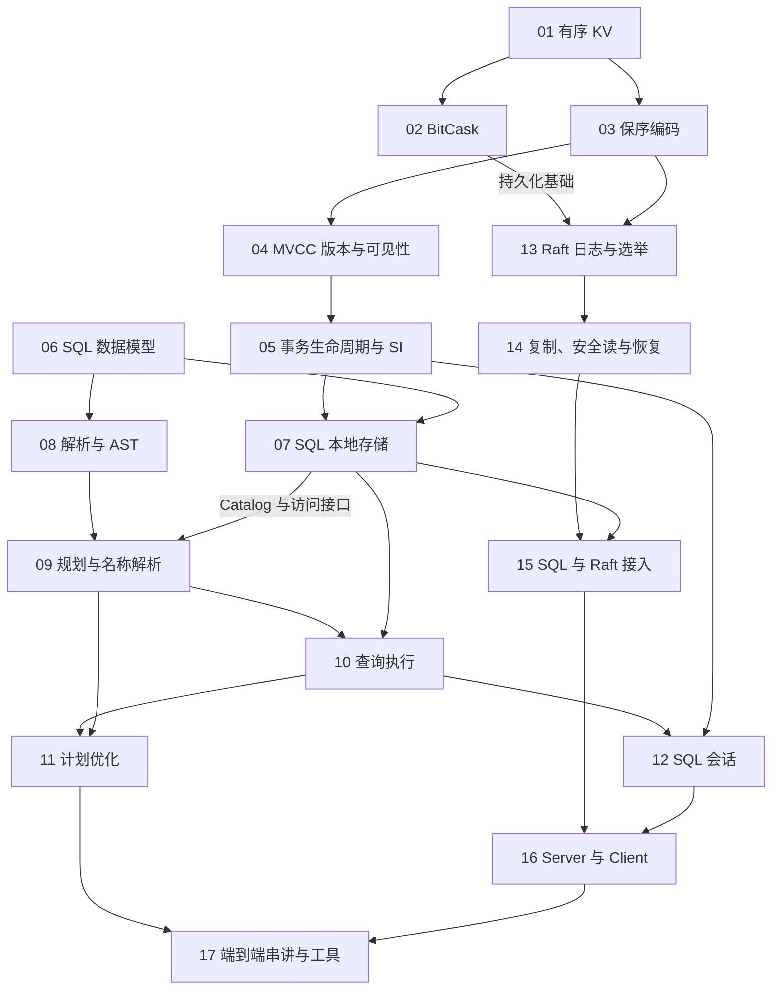

# toyDB 分章学习地图

> 目标：独立阅读 toyDB 实现，能沿接口、数据结构、调用关系和测试定位行为。
> 范围：覆盖当前仓库的核心模块、关键正确性问题和运行工具，不把整个数据库领域当作必修课。
> 教学方式：自底向上、小步带读、讲解为主。暂时跳过对学习者的测验、反问、作业和过关检查；源码与测试的核对仍由讲解者完成。

会话进度见 [learning-notes.md](learning-notes.md)。完整讲解按章节号写在 [lectures/](lectures/README.md)，覆盖 00.1–17.8 共 106 个知识点。本文件仍是课程目录与依赖图。

## 使用约定

- 每个 `章号.小节号` 是一个稳定的知识点编号，通常一次只讲一节；复杂小节可以继续拆分。
- 每节按“解决什么问题 → 在系统中的位置 → 最小代码片段 → 行为示例 → 边界”组织，不逐行念完整文件。
- Rust 按需解释，不要求先完成 Rust 课程。源码中的同名类型始终标明模块。
- 测试先作为行为示例讲解，是否实际运行另行明确；不要求学习者先预测结果。
- 进度只记录“已讲解 / 待讲解 / 已运行验证”，不把听过讲解记成已经掌握。
- 以下源码路径均相对仓库根目录。架构文档可能引用旧提交；具体方法、编码、错误和边界以当前源码与测试为准。
- 本次已核对模块目录、架构索引及相关文档；这是课程规划，不代表已逐项审计全部函数或运行全部测试。

## 一、章节总览

| 章 | 主题 | 贯穿本章的主线 | 进度 |
| --- | --- | --- | --- |
| 00 | 全局地图与阅读方法 | 各层各自负责什么 | 已讲；[lectures/00.md](lectures/00.md) |
| 01 | 有序 KV 与 Memory | 从单点访问到范围扫描 | 已讲；[lectures/01.md](lectures/01.md) |
| 02 | BitCask 持久化 | 追加日志如何实现可更新的存储 | 已讲；[lectures/02.md](lectures/02.md) |
| 03 | 编码与 key 布局 | 字节排序如何保留业务顺序 | 已讲；[lectures/03.md](lectures/03.md) |
| 04 | MVCC 版本与可见性 | 同一份数据如何提供多个视图 | 已讲；[lectures/04.md](lectures/04.md) |
| 05 | 事务生命周期与隔离边界 | 开始、冲突、提交、回滚、历史读取 | 已讲；[lectures/05.md](lectures/05.md) |
| 06 | SQL 数据模型与表达式 | 字节之上如何表达表、行和值 | 已讲；[lectures/06.md](lectures/06.md) |
| 07 | SQL 本地存储与索引 | 表、行、索引如何映射到事务 KV | 已讲；[lectures/07.md](lectures/07.md) |
| 08 | Lexer、Parser 与 AST | SQL 文本如何成为语法结构 | 已讲；[lectures/08.md](lectures/08.md) |
| 09 | Planner 与名称解析 | 语法如何成为可执行计划 | 已讲；[lectures/09.md](lectures/09.md) |
| 10 | 查询执行器 | 计划节点如何逐步产生结果行 | 已讲；[lectures/10.md](lectures/10.md) |
| 11 | 启发式优化器 | 改变执行方式而保留语义 | 已讲；[lectures/11.md](lectures/11.md) |
| 12 | SQL 会话与事务管理 | 多条 SQL 如何共享或结束事务 | 已讲；[lectures/12.md](lectures/12.md) |
| 13 | Raft 基础、日志与选举 | 节点如何选出有资格的 Leader | 已讲；[lectures/13.md](lectures/13.md) |
| 14 | Raft 复制、读取与恢复 | 写入何时可确认，读取何时安全 | 已讲；[lectures/14.md](lectures/14.md) |
| 15 | SQL 与 Raft 的连接 | SQL 存储操作如何变成复制命令 | 已讲；[lectures/15.md](lectures/15.md) |
| 16 | Server、Client 与进程启动 | 线程、通道和 TCP 如何接起各层 | 已讲；[lectures/16.md](lectures/16.md) |
| 17 | 测试、工具与端到端串讲 | 用完整请求和故障场景连接知识 | 已讲；[lectures/17.md](lectures/17.md) |

**主线讲义已按章号写完。** 运行集群不是开始读源码的前置条件。本轮未运行 `cargo test` 或启动集群；行为示例来自仓库脚本的预期输出与当前源码。

## 二、知识图谱

### 2.1 知识归属树

这张树回答“有哪些知识、分别归在哪里”，不是运行时调用链。

```text
toyDB：读懂一个分布式 SQL 数据库
├── 全局定位：00 边界、模块、阅读方法
├── 单机数据基础
│   ├── 01 有序 KV：字节、点查、范围、迭代器
│   ├── 02 BitCask：追加写、KeyDir、删除、恢复、压缩
│   └── 03 编码：Bincode、Keycode、复合 key、前缀边界
├── 事务
│   ├── 04 MVCC：逻辑版本、活跃集合、快照、可见性
│   └── 05 生命周期：写冲突、提交、回滚、只读、时间旅行、SI
├── SQL
│   ├── 06 数据模型：Value、Row、Schema、Expression、NULL
│   ├── 07 本地存储：Catalog、行 key、主键、二级索引、约束
│   ├── 08 解析：字符 → Token → AST
│   ├── 09 规划：名称解析 → 列位置 → 计划树
│   ├── 10 执行：扫描、过滤、投影、Join、聚合、排序、写入
│   ├── 11 优化：常量折叠、下推、索引查找、Hash Join、短路
│   └── 12 会话：自动提交、显式事务、错误与清理
├── 分布式复制
│   ├── 13 Raft 基础：日志、状态机、角色、消息、选举
│   ├── 14 Raft 正确性：复制、提交、apply、安全读、故障恢复
│   └── 15 接入 SQL：Read/Write 命令、事务恢复、应用进度
├── 运行与验证
│   ├── 16 服务通信：线程、channel、TCP、配置、客户端
│   └── 17 行为证据：脚本测试、集群测试、诊断、性能、完整链路
└── 随读随补
    ├── Rust：所有权、trait、迭代器、enum、并发、错误
    └── 扩展对照：B+ 树、LSM、SSI、分片、快照、成本优化
```

### 2.2 核心学习依赖图

箭头 `A → B` 表示“理解 A 有助于理解 B”，**不表示函数调用、网络请求或严格必修关系**。图中只保留核心依赖，Rust 与测试贯穿全部章节。不支持 Mermaid 的阅读器可直接使用上面的文本树。



### 2.3 需要跨章节反复连接的概念

| 概念连接 | 对应章节 | 讲解时必须保留的区别 |
| --- | --- | --- |
| 有序 key → 表扫描、版本扫描、日志扫描 | 01、03、04、07、13 | 同一底层接口，不同上层编码 |
| BTreeMap → KeyDir → SQL 二级索引 | 01、02、07 | 数据结构、物理定位索引、业务索引不是同一层 |
| BitCask 旧记录 → MVCC 历史版本 → Raft 日志 | 02、05、14 | 三种历史，三种保留目的；压缩一种不会自动清理另外两种 |
| `set` → `flush` → Raft commit → SQL COMMIT | 02、05、14、15 | 写入、持久化、复制提交、事务提交不是同一件事 |
| MVCC version → Raft term/index → ReadSequence | 04、13、14 | 不同计数器，不能互换成同一个“时间戳” |
| SQL AST → 执行 Expression → 计划 Node | 06、08、09 | 语法表示、求值表示、操作组织各有职责 |
| `NULL` → 过滤 → Join → 优化 | 06、10、11 | SQL 三值逻辑不同于 Rust 普通相等判断 |
| Storage scan → Rows → Raft scan 返回值 | 01、10、15 | 底层迭代器不等于跨网络全程流式处理 |
| SI → 线性一致性 → 可串行化 | 05、14、15 | 事务视图、单次操作顺序、多操作事务等价性分别讨论 |
| 错误 → 回滚 → Abort → 客户端重试 | 05、12、14、16 | 失败响应不等于任何时刻都能无脑重试；不能假设 exactly-once |

## 三、逐章知识点

### 00 全局地图与阅读方法

- **00.1** 教学数据库的目标与非目标：正确性、易理解，以及性能、扩展性和生产能力的边界。
- **00.2** 分层职责：底层 KV、MVCC、SQL 存储、查询处理、Raft、网络。
- **00.3** 区分 `storage::Engine`、`sql::engine::Engine` 与 `raft::State`；阅读模块导出与程序入口。
- **00.4** 文档、当前源码、测试输入和预期输出如何相互核对；示意图不是具体实现。

入口：`README.md`、`docs/architecture/index.md`、`docs/architecture/overview.md`、`src/lib.rs`、`Cargo.toml`。

### 01 有序 KV 与 Memory

- **01.1** 字节 KV 的职责；`get` 与 `scan`；字节字典序、范围边界、前缀扫描；`BTreeMap` 包装与逐项复制。
- **01.2** `set/delete/get` 的接口契约：覆盖写、删除不存在的 key、空 value 与不存在的区别、`Result<Option<_>>`。
- **01.3** 迭代器的借用期限、正反向扫描、关联类型；`scan` 与 `scan_dyn` 的静态/动态分派边界。
- **01.4** `&mut self`、`Send`、单使用者设计；Memory 的 `flush` 不提供磁盘持久化；状态统计。

源码：`src/storage/engine.rs`、`src/storage/memory.rs`。
文档：`docs/architecture/storage.md`。
行为示例：`src/storage/testscripts/engine/`、`src/storage/testscripts/memory/status`。

### 02 BitCask 持久化

- **02.1** 追加写文件为什么能覆盖更新和删除：最新记录、KeyDir 与 tombstone。
- **02.2** 磁盘记录布局：key/value 长度、字节内容、文件位置；顺序写与随机读。
- **02.3** 打开文件、重建 KeyDir；重复 key、删除记录与不完整尾记录的实际处理路径。
- **02.4** 写缓冲、`flush`、文件同步与失败传播；写入成功不等于已经持久化。
- **02.5** 通过有序 KeyDir 范围扫描，按文件位置加载 value；逻辑有序不等于磁盘记录有序。
- **02.6** 文件压缩与替换、打开时的压缩策略、垃圾空间统计；所有 key 驻留内存的容量限制。

源码：`src/storage/bitcask.rs`，对照 `src/storage/engine.rs`。
文档：`docs/architecture/storage.md`。
行为示例：`src/storage/testscripts/bitcask/`、共用 engine 脚本。

### 03 编码与 key 布局

- **03.1** 序列化/反序列化、Serde、`encoding::Key` 与 `encoding::Value`；编码和业务语义的边界。
- **03.2** Bincode 的用途、统一配置、按已知类型解码，以及格式兼容性风险。
- **03.3** 为什么普通序列化未必保序；大小端、无符号整数、有符号整数与浮点数的编码思路。
- **03.4** 字符串与字节的终止和转义、复合字段、枚举标签；复合 key 的排序优先级。
- **03.5** `prefix_range` 的边界：空前缀、尾部 `0xff`、没有有限上界；保序与往返解码测试。
- **03.6** `encoding::format` 如何把真实字节转成可读的存储/测试输出。

源码：`src/encoding/mod.rs`、`src/encoding/bincode.rs`、`src/encoding/keycode.rs`、`src/encoding/format.rs`。
文档：`docs/architecture/encoding.md`。
行为示例：编码文件内测试、`src/storage/testscripts/engine/scan_prefix`。

### 04 MVCC 版本与可见性

- **04.1** 用“逻辑 key + version”存多版本；版本是逻辑序号，不是墙上时钟或提交时间。
- **04.2** `NextVersion`、活跃事务集合与事务开始时的活跃集合快照。
- **04.3** 可见性条件：自己的写入、较新版本、开始时未提交的旧版本分别如何处理。
- **04.4** 单点读如何利用版本顺序找到最新可见值；反向扫描与删除标记。
- **04.5** 范围读如何折叠同一 key 的多个版本、过滤不可见记录、处理双向遍历。
- **04.6** 存储共享、锁与事务对象；实现中的互斥锁不等于事务层可串行化。

源码：`src/storage/mvcc.rs`。
文档：`docs/architecture/mvcc.md`，优先对照源码模块注释。
行为示例：`src/storage/testscripts/mvcc/get_isolation`、`src/storage/testscripts/mvcc/scan_isolation`、`src/storage/testscripts/mvcc/scan_key_version_encoding`。

### 05 事务生命周期与隔离边界

- **05.1** 读写事务开始时的状态分配；`TransactionState`、恢复事务与元数据。
- **05.2** 写入和删除如何共用版本写路径；并发写冲突检查与错误。
- **05.3** 写集合追踪、提交时的活跃标记删除；一次元数据变化如何改变整组写入的可见性。
- **05.4** 回滚如何定位并删除本事务版本；清理顺序与失败处理。
- **05.5** 只读事务、历史版本读取、历史活跃集合快照；只读可见边界不能机械照搬读写事务。
- **05.6** 脏读、不可重复读、读偏斜、幻读、丢失更新、写偏斜：由讲解者展开现有脚本，不要求先答题。
- **05.7** SI 不等于可串行化；ACID 的职责拆分；MVCC 未实现历史版本 GC，持久性还需结合 Raft 接入分析。

源码：`src/storage/mvcc.rs`；持久性在第 15 章连接 `src/sql/engine/raft.rs`。
行为示例：`src/storage/testscripts/mvcc/` 中 begin、resume、冲突、rollback、bank 和 anomaly 系列。

### 06 SQL 数据模型与表达式

- **06.1** `DataType`、`Value`、`Row` 与 `Rows`；Rust 值和 SQL 值的对应关系。
- **06.2** NULL 与三值逻辑、NaN、比较/排序/相等的不同用途；不能用 Rust 比较直接替代 SQL 语义。
- **06.3** `Table`、`Column`、主键、默认值、非空、唯一、外键和索引属性。
- **06.4** 表结构验证与行验证；哪些校验需要访问其他表或其他行。
- **06.5** 表达式树、常量与列引用、递归求值、类型错误和算术错误。

源码：`src/sql/types/value.rs`、`src/sql/types/schema.rs`、`src/sql/types/expression.rs`。
文档：`docs/architecture/sql-data.md`。
行为示例：`src/sql/testscripts/expressions/`、`src/sql/testscripts/schema/`。

### 07 SQL 本地存储与索引

- **07.1** SQL `Engine`、`Transaction`、`Catalog` 接口与 `Local`；SQL 存储不是底层 KV 接口的同义词。
- **07.2** 表结构、表行、二级索引的 key/value 表示；`Key`、`KeyPrefix` 与 MVCC 的叠加。
- **07.3** 主键点查、全表前缀扫描、二级索引值到主键集合，再到行数据。
- **07.4** 批量插入、更新、删除；更换主键、维护新旧二级索引记录。
- **07.5** Catalog 的建表、删表、查表；表数据和索引的清理，DDL 与事务。
- **07.6** 类型、唯一性、引用完整性的校验位置与并发边界；不把接口校验直接等同于所有业务不变量成立。

源码：`src/sql/engine/engine.rs`、`src/sql/engine/local.rs`、`src/sql/types/schema.rs`。
文档：`docs/architecture/sql-storage.md`。
行为示例：`src/sql/testscripts/schema/`、`src/sql/testscripts/writes/`、主键和二级索引查询脚本。

### 08 Lexer、Parser 与 AST

- **08.1** 从字符识别 token：关键字、标识符、字面量、标点、运算符和非法输入。
- **08.2** SQL 语句与表达式的 AST 结构；AST 保留什么，尚未解决什么。
- **08.3** 解析器的前瞻、消费 token、语句分派、错误传播。
- **08.4** 运算符优先级、结合性、括号、一元与二元表达式。
- **08.5** SELECT、JOIN、聚合相关子句、写语句、DDL 与事务语句的解析入口；以 `docs/sql.md` 为方言范围。

源码：`src/sql/parser/lexer.rs`、`src/sql/parser/ast.rs`、`src/sql/parser/parser.rs`。
文档：`docs/architecture/sql-parser.md`、`docs/sql.md`。
行为示例：解析器文件内测试、`src/sql/testscripts/expressions/op_precedence`。

### 09 Planner 与名称解析

- **09.1** AST、执行表达式与计划树的区别；计划节点的输入输出。
- **09.2** Catalog 查询、Scope、表别名、列名歧义、限定名和星号展开。
- **09.3** 从列名到行内位置；投影、Join 和重映射后的列位置变化。
- **09.4** WHERE、GROUP BY、HAVING、ORDER BY、LIMIT/OFFSET 的计划组织，不机械套用 SQL 文本顺序。
- **09.5** 写语句与 DDL 的规划；合法语法为何仍可能规划失败。
- **09.6** EXPLAIN、计划树格式化与树遍历/变换接口。

源码：`src/sql/planner/plan.rs`、`src/sql/planner/planner.rs`。
文档：`docs/architecture/sql-planner.md`。
行为示例：`src/sql/testscripts/queries/`、`src/sql/testscripts/writes/`。

### 10 查询执行器

- **10.1** 计划节点到执行器的分派；拉取式行迭代器与惰性错误传播。
- **10.2** 扫描、主键查找、索引查找、过滤、投影和列重映射。
- **10.3** Nested Loop Join、Hash Join、内连接和外连接；匹配、重复行、NULL 补齐。
- **10.4** 聚合器状态、分组、空输入、COUNT/SUM 等聚合及 NULL 的处理。
- **10.5** 排序、LIMIT/OFFSET；哪些操作逐行处理，哪些需要缓冲数据。
- **10.6** INSERT/UPDATE/DELETE 与 DDL 如何调用事务存储接口；结果类型与受影响行数。

源码：`src/sql/execution/executor.rs`、`src/sql/execution/join.rs`、`src/sql/execution/aggregator.rs`、`src/sql/types/value.rs`。
文档：`docs/architecture/sql-execution.md`。
行为示例：`src/sql/testscripts/queries/`、`src/sql/testscripts/writes/`。

### 11 启发式优化器

- **11.1** 规则优化与成本优化的区别；优化器顺序、前序/后序树变换。
- **11.2** 常量折叠、逻辑化简与 SQL 特殊值的语义边界。
- **11.3** 合取范式、谓词拆分、过滤下推、Join 两侧的列引用重映射和下推限制。
- **11.4** 从 Scan 到 KeyLookup/IndexLookup；可提取条件与残余过滤条件。
- **11.5** 从 Nested Loop Join 到 Hash Join；适用连接条件。
- **11.6** 空结果与短路计划；逐轮比较计划，而不是把“更快”当作“正确”的证据。

源码：`src/sql/planner/optimizer.rs`、`src/sql/planner/plan.rs`、`src/sql/types/expression.rs`。
文档：`docs/architecture/sql-optimizer.md`。
行为示例：`src/sql/testscripts/optimizers/`。

### 12 SQL 会话与事务管理

- **12.1** Session 持有什么状态；一个连接、多条语句和一个事务的关系。
- **12.2** 自动提交与显式 BEGIN/COMMIT/ROLLBACK；只读和历史查询入口。
- **12.3** 解析、规划、优化、执行由谁串联；EXPLAIN 的特殊路径。
- **12.4** 执行失败后事务状态、清理和连接结束；区分语句错误与事务终止。
- **12.5** SQL 事务接口如何映射到 MVCC，而不让调用者直接操作版本号。

源码：`src/sql/execution/session.rs`、`src/sql/engine/engine.rs`；连接结束路径在第 16 章结合 `src/server.rs`。
文档：`docs/architecture/sql-execution.md`。
行为示例：`src/sql/testscripts/transactions/`、`tests/scripts/errors`。

### 13 Raft 基础、日志与选举

- **13.1** 状态机复制、确定性、安全性与活性、多数派交集；Raft 不负责事务隔离或数据分片。
- **13.2** Entry 的 index/term/command；Log 与 State 接口；持久化 term、vote 和提交进度。
- **13.3** Follower/Candidate/Leader、`Node` 与角色类型；`tick`、`step` 和消息信封。
- **13.4** 随机选举超时、发起竞选、投票、平票重试、心跳与角色切换。
- **13.5** 每任期最多一票、日志新旧比较（不能只看长度）、旧消息处理；为什么投票状态要持久化。
- **13.6** Leader 变更时的未完成请求、Follower 转发与 Candidate 拒绝请求。

源码：`src/raft/mod.rs`、`src/raft/log.rs`、`src/raft/state.rs`、`src/raft/message.rs`、`src/raft/node.rs`。
文档：`docs/architecture/raft.md`。
行为示例：`src/raft/testscripts/log/`；node 下 election、tick、old 消息及请求转发脚本。

### 14 Raft 复制、读取与恢复

- **14.1** 本地 append → 复制 → 满足提交条件 → apply → 回复；当前任期条件与新 Leader 的空日志条目。
- **14.2** 日志匹配、前一条的 index/term、冲突拒绝、探测、补齐与未提交后缀替换。
- **14.3** 每个 Follower 的复制进度、match/next index、批量发送、重复或过时响应的处理。
- **14.4** 线性一致读取：旧 Leader 风险、ReadSequence、多数派确认与状态机应用进度。
- **14.5** 重启、持久化日志与状态机重放；commit index 和 applied index 的区别。
- **14.6** 确定性错误和 I/O 错误的处理；断连、选主、丢失消息和客户端结果的不确定性。
- **14.7** 当前限制：无状态快照、无日志前缀截断、无在线成员变更、无 leader lease、无 pre-vote/check-quorum；不能把这些当作已有能力。

源码同第 13 章，重点为 `src/raft/node.rs` 和 `src/raft/log.rs`。
行为示例：`src/raft/testscripts/node/` 中 append、heartbeat、restart、request_leader_read_quorum、request_leader_change_linearizability 等脚本。

### 15 SQL 与 Raft 的连接

- **15.1** SQL 的 `Local` 与 `Raft` 实现如何满足同一个接口，查询处理为何可复用。
- **15.2** `Read`/`Write` 枚举与 Bincode 命令；复制的是 SQL 存储操作，不是原样 SQL 字符串。
- **15.3** 事务状态随命令传递、`resume` 重建事务；不能依赖 Leader 内存中的事务对象一直存在。
- **15.4** 状态机的解码、Local 调用、返回值编码、applied index 保存与恢复。
- **15.5** Raft 日志提供的持久性与 SQL/MVCC 状态的重放；SQL COMMIT 本身如何进入复制路径。
- **15.6** 读不追加日志但需要 Raft 协调；快照读取仍遵守事务可见性，而非总读最新行版本。
- **15.7** 扫描结果的缓冲与网络边界：底层迭代器不意味着跨 Raft 流式传输。

源码：`src/sql/engine/raft.rs`、`src/sql/engine/local.rs`、`src/raft/state.rs`、`src/storage/mvcc.rs`。
文档：`docs/architecture/sql-raft.md`。
行为示例：结合 SQL 与 Raft 模块测试，并在 `tests/scripts/isolation`、`tests/scripts/anomalies` 中看集成行为。

### 16 Server、Client 与进程启动

- **16.1** 配置加载、日志初始化、存储选择、Raft Log 和 SQL State 的组装。
- **16.2** 标准线程与 Crossbeam channel；Raft 路由线程如何处理 tick、peer 消息和本地请求。
- **16.3** SQL 与 Raft 独立监听地址；TCP 接收、发送、连接重建与消息编码。
- **16.4** 请求 ID、响应通道和等待中的请求；Follower 请求如何往返 Leader。
- **16.5** 每个 SQL 连接的 Session、结果返回、错误与断连清理。
- **16.6** Client 请求响应接口、`toysql` REPL、SQL 与管理命令；不假设 MySQL/PostgreSQL 协议兼容。

源码：`src/server.rs`、`src/client.rs`、`src/bin/toydb.rs`、`src/bin/toysql.rs`、`src/error.rs`。
文档：`docs/architecture/server.md`、`docs/architecture/client.md`。
运行入口：`cluster/run.sh`、`cluster/toydb1/toydb.yaml`。

### 17 测试、工具与端到端串讲

- **17.1** Goldenscript 输入/预期输出、runner 与宏生成测试；共用接口测试和模块专用测试的区别。
- **17.2** 内存单元测试、模拟 Raft 消息时序与真实进程集群测试；覆盖范围与证据边界。
- **17.3** `toydump`、存储格式化、状态统计、日志、EXPLAIN 与调试入口。
- **17.4** `workload` 的 read/write/bank、吞吐量与延迟分位数；fsync、批量与缓冲的取舍，不照搬 README 数值。
- **17.5** 从客户端追一条 SELECT：标明解析/执行节点、存储请求、Raft 安全读、本地 MVCC 和返回值。
- **17.6** 追一条 INSERT 与显式事务 COMMIT：区分各次复制操作、事务可见性与成功回复。
- **17.7** 追一次事务冲突和一次 Leader 故障：由讲解者展开已验证的时序，区分本地脚本和真实故障实验。
- **17.8** 把模块边界、数据表示、正确性保证与资源瓶颈汇总成全景；可选修改练习仅在用户主动要求时安排。

源码和配置：`tests/tests.rs`、`tests/testcluster.rs`、`tests/scripts/`、`src/bin/toydump.rs`、`src/bin/workload.rs`、`src/encoding/format.rs`、`.github/workflows/ci.yml`、`.vscode/launch.json`。

## 四、Rust 随读随补索引

| Rust 知识 | 首次重点出现 | 只解决眼前的阅读问题 |
| --- | --- | --- |
| tuple struct、`Vec<u8>`、切片、所有权和 clone | 01 | `Memory` 包装了什么，返回值由谁拥有 |
| `Option`、`Result`、`?`、错误转换 | 01–02 | 不存在、正常结束和失败如何区分 |
| trait、关联类型、泛型、生命周期、`dyn`、`Box` | 01、07 | 接口替换与借用迭代器，不先推演全部类型系统 |
| Iterator、DoubleEndedIterator、闭包、惰性求值 | 01、04、10 | 每调用一次 next 实际做了什么 |
| 文件 I/O、Seek、缓冲、Drop 与资源释放 | 02 | 数据什么时候写入、落盘、关闭 |
| Serde、derive、enum、模式匹配 | 03、06、08 | 类型如何编码以及如何按变体分派 |
| `Arc`、`Mutex`、Guard、`Cow` | 04–05 | 共享数据、借用期限与需要复制的地方 |
| 递归数据结构与树遍历 | 06、08–11 | 表达式、AST 和计划的变换 |
| 角色泛型与 typestate | 13 | 为什么不同角色拥有不同方法 |
| 线程、Send、channel、消息所有权转移 | 15–16 | 谁运行代码、谁持有状态、谁等待结果 |
| `cfg(test)`、测试宏、golden 输出 | 全程、17 | 测试从哪里生成，输入怎样驱动实现 |

## 五、扩展知识边界

以下用于对照设计，不作为继续主线的前置课程，也不暗示 toyDB 已实现。

| 对照主题 | 适合接在哪章后 | 范围 |
| --- | --- | --- |
| B+ 树、页、缓冲池、LSM/SSTable/WAL | 02 | 比较存储结构，不把 toyDB 当成页面式 B+ 树引擎 |
| Serializable、SSI、锁式并发控制、MVCC GC | 05 | 解释 SI 的能力边界与历史保留代价 |
| 联合/覆盖索引、统计信息、成本优化 | 07、11 | 与当前索引布局和启发式规则对照 |
| 向量化执行、外部排序、磁盘溢写、并行执行 | 10 | 与当前迭代器和内存缓冲方式对照 |
| Raft 快照、日志截断、成员变更、租约、去重 | 14 | 区分核心协议和生产机制 |
| 分片、Multi-Raft、跨分片事务、2PC | 15 | 解释复制与水平扩展的区别 |
| 认证、TLS、配额、监控、备份与协议兼容 | 16–17 | 明确生产能力的核验需求，不把教学系统当成可直接上线产品 |

配套课程、书籍和论文继续复用 [learning-notes.md](learning-notes.md) 中的资料清单，遇到具体问题再查，不扩张成新的阅读负担。

## 六、当前游标

- 讲义状态：**00.1–17.8 全部已写入 [lectures/](lectures/README.md)**（共 106 个二级标题）。已讲解 ≠ 已检验掌握。
- 验证状态：对照当前源码与仓库测试脚本的预期输出撰写；未运行 `cargo test`，未启动集群。
- 追问或深入某一节时，直接说编号即可，例如：

> 请按 docs/lectures/02.md 的 02.1 讲 BitCask。讲解为主，先跳过测验和反问。
